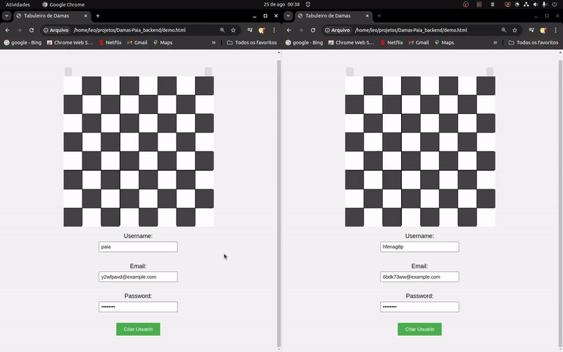

<p align="center" >
  <a href="#" target="blank"></a>
</p>

<p>
    <p align="center">Jogo de Damas online multiplataforma</p>
</p>

## Descrição

Este é o repositório do backend do projeto **DamasPaia**, um jogo de damas online desenvolvido com **NestJS**, **TypeORM**, **Socket.io** e **PostgreSQL**. O projeto possui uma cobertura robusta de testes, tanto unitários quanto end-to-end.

| Plataforma                                                   | Tecnologia   | Status       |
| ------------------------------------------------------------ | ------------ | ------------ |
| [Backend](https://github.com/6aleatorio6/Damas-Paia_backend) | NestJS       | Em andamento |
| [Mobile](https://github.com/6aleatorio6/Damas-Paia_mobile)   | React Native | Em andamento |
| Web                                                          | React        | Não iniciado |


## Funcionalidades

### Segurança

- **Autenticação de Usuário:** Realiza autenticação via nome e senha, fornecendo um token JWT.
- **Revalidação de Token:** Garante a revalidação de tokens expirados.
- **Autenticação OAuth2:** Integração com provedores OAuth2 como Google, Discord e GitHub, permitindo que os usuários criem contas diretamente por esses provedores.
- **Conexões WebSocket Protegidas:** Implementa conexões WebSocket seguras utilizando tokens.
- **Desconfiança com o Frontend:** O backend utiliza o UUID do token para identificar o usuário, inclusive nas conexões WebSocket.

### Jogo

- **Peças:** Cada jogador inicia com 12 peças.
- **Fila de Pareamento:** Gerencia a fila de jogadores que desejam criar uma partida.
- **Exibição de Caminhos Disponíveis:** Indica os caminhos válidos que cada peça pode seguir no tabuleiro.
- **Movimentação das Peças:** Permite que as peças sejam movidas ao longo do tabuleiro de acordo com as regras.
- **Promoção para Damas:** Quando uma peça comum alcança a extremidade oposta do tabuleiro (y: 0 ou y: 7), ela se torna uma dama, ganhando movimentos adicionais.
- **Validação dos Movimentos:** Cada movimento das peças é validado de acordo com as regras do jogo, garantindo jogadas legais.
- **Gerenciamento de Turnos:** Controla a alternância de turnos entre os jogadores, garantindo que cada um jogue na sua vez.
- **Finalização de Partida:**
  - A partida termina automaticamente quando um jogador fica sem peças, resultando em sua derrota.
  - A partida também pode terminar se um jogador desconectar do socket por um período maior que o definido em `TIMEOUT_TO_RECONNECT`, sendo declarado perdedor.
  - Se uma partida permanecer em aberto com jogadores desconectados, o frontend pode chamar o endpoint `match/check-and-finish` para finalizá-la.
- **Captura de Peças:** 
  - As peças comuns podem capturar peças adversárias, inclusive realizando capturas para trás.
  - A captura não é obrigatória; os jogadores têm a opção de não capturar.
  - As peças podem realizar capturas em cadeia, permitindo que uma única peça capture múltiplas peças adversárias em sequência, mesmo que isso envolva curvas.
- **Ranking de Partidas:** Permite obter uma classificação dos jogadores com base em suas performances em partidas anteriores.
- **Histórico de Partidas:** Os jogadores podem acessar um registro de todas as suas partidas jogadas anteriormente.


### Usuário

- **Cadastro de Usuário:** Permite criar um novo usuário no sistema.
- **Verificação de Usuário:** Verifica se o nome de usuário ou email já existe.
- **Manipulação de Usuário:** Rotas protegidas por token para obter, editar e excluir usuários.


## Instalação

1. Clone o repositório:

   ```bash
   git clone https://github.com/6aleatorio6/Damas-Paia_backend.git
   ```

2. Acesse o diretório do projeto:

   ```bash
   cd Damas-Paia_backend
   ```

3. Crie um arquivo `.env` usando o `.env.example` como base:

   ```bash
   cp .env.example .env
   ```

## Executando a Aplicação

Para iniciar a aplicação com Docker Compose, utilize o seguinte comando:

```bash
 npm run compose:dev
```

## Testes

### Testes Unitários

Atualmente, a aplicação possui **44 testes unitários**. Para executá-los, utilize o seguinte comando:

```bash
npm run compose test
```

### Testes E2E

A aplicação conta com **54 testes end-to-end**. Para executá-los, utilize o seguinte comando:

```bash
npm run compose test:e2e
```

### Modo Watch

Para executar os testes automaticamente sempre que houver mudanças nos arquivos, utilize o modo watch. O comando a seguir permite que você especifique um padrão para os arquivos que deseja observar:

```bash
npm run compose test:e2e -- --watch <pattern>
npm run compose test -- --watch <pattern>
```

Substitua <pattern> pelo caminho ou padrão de arquivos que deseja monitorar.

## Teste o Jogo de Damas com `demo.html`

O `demo.html` serve como um frontend simples para testar o jogo de damas. Conseguindo testar as seguintes partes:

- **Criação de Usuário**: Permite criar um novo usuário e conectar ao servidor.
- **Pareamento**: Coloca o usuario criado na fila de pareamento.
- **Simulação de Partida**: Abra duas abas para simular uma partida completa.



### Para simular uma partida:

O backend deve estar em execução em `localhost:3000`.

1. **Abra o Arquivo**:
   Use duas abas ou janelas diferentes do navegador para abrir `demo.html`.

2. **Crie e Conecte Usuários**:
   O formulário é preenchido automaticamente com valores aleatórios. Clique em **Criar Usuario** em ambas as abas para conectar dois jogadores.

3. **Inicie a Partida**:
   A partida começará automaticamente após ambos os jogadores se conectarem.

## Criador

- **Autor:** Leonardo L. Felix
  - **Email:** [leonardolfelix12@gmail.com](mailto:leonardolfelix12@gmail.com)
  - **GitHub:** [6aleatorio6](https://www.github.com/6aleatorio6)
